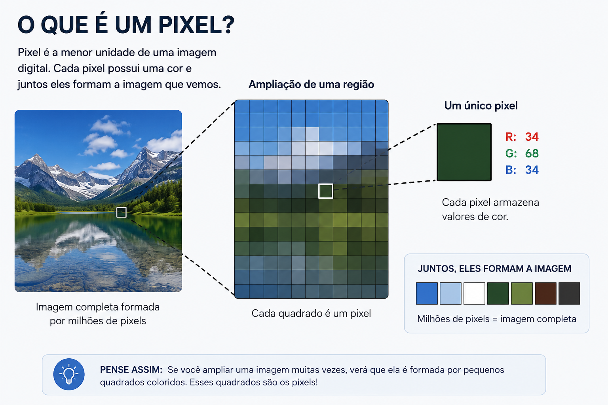

---
sidebar:
  order: 1
slug: cv-introducao
title: Introdução à visão computacional
---

# Introdução à visão computacional

## O que é Visão Computacional?
<iframe style={{ display: 'block', margin: 'auto', width: '100%', height: '50vh', }} src="https://www.youtube.com/watch?v=RSkbjZZb-1c" frameborder="0" allowFullScreen> </iframe>


## 1. O que é uma imagem?

Uma imagem digital é uma **representação numérica** de uma cena visual. Ela é composta por uma **matriz de pixels** em que cada elemento registra uma intensidade ou uma combinação de canais de cor.

### 1.1 Matriz de pixels

Cada pixel é uma unidade mínima da imagem. Em uma imagem em escala de cinza, cada pixel contém um valor de intensidade. Em uma imagem colorida, cada pixel contém um vetor de valores para cada canal de cor.



* Escala de cinza: matriz 2D de shape `(altura, largura)`.
* Cor (RGB): matriz 3D de shape `(altura, largura, 3)`.

### 1.2 Intensidade vs cor

* **Intensidade** representa brilho. Uma imagem em escala de cinza usa apenas um valor por pixel.
* **Cor** representa a combinação de componentes de cor. Em RGB, cada pixel usa três valores: vermelho, verde e azul.

Exemplo simples:

```python
# Escala de cinza 3x3
gray = [
    [10, 20, 30],
    [40, 50, 60],
    [70, 80, 90]
]

# RGB 2x2
rgb = [
    [[255, 0, 0], [0, 255, 0]],
    [[0, 0, 255], [255, 255, 0]]
]
```

### 1.3 Resolução

A resolução descreve quantos pixels existem na imagem. Ela é normalmente expressa como `largura × altura`.

* Uma imagem 640×480 tem 307200 pixels.
* Uma imagem 1920×1080 (Full HD) tem 2073600 pixels.

Resolução controla a **quantidade de detalhe** disponível: quanto mais pixels, mais detalhes podem ser representados.

## 2. A imagem como matriz numérica

Toda imagem digital é representada como uma **matriz de números inteiros** entre 0 e 255 (para 8 bits):

* **Imagem em escala de cinza** – uma matriz 2D de shape `(altura, largura)`, onde cada valor representa brilho de um pixel
* **Imagem colorida (RGB)** – uma matriz 3D de shape `(altura, largura, 3)`, onde cada pixel é um vetor `[R, G, B]`
* **Imagem com transparência (RGBA)** – shape `(altura, largura, 4)`, onde o 4º canal é a opacidade

### 2.1 Exemplo 

Uma imagem de 4×4 pixels em RGB tem 48 valores numéricos (4 × 4 × 3). Operações de processamento transformam esses números:

```
Original (primeiros 3 pixels, canal R):
[255  200  150]
[ 100  50   25]

Após filtro Sobel (detecção de borda):
[  0   85  125]
[ 45   78  200]
```

## 3. Ferramentas computacionais

As principais bibliotecas para visão computacional em Python são:

* **OpenCV** – rápida, otimizada em C++, possui a maioria dos algoritmos clássicos
* **PIL/Pillow** – simples, bom para operações básicas de imagem
* **scikit-image** – integrada ao ecossistema NumPy/SciPy, excelente para prototipagem
* **TensorFlow/PyTorch** – para redes neurais profundas

Usaremos principalmente **OpenCV** e **NumPy** neste material.

:::tip Exercício
Instale as dependências e carregue uma imagem:
```python
import cv2
import numpy as np
from PIL import Image

# Carregar com OpenCV (BGR por padrão)
img_cv = cv2.imread('sua_imagem.jpg')

# Carregar com PIL (RGB por padrão)
img_pil = Image.open('sua_imagem.jpg')

# Carregar como NumPy array
img_np = np.array(img_pil)

print(f"Shape: {img_np.shape}")
print(f"Tipo: {img_np.dtype}")
```

Teste com uma imagem do seu computador ou baixe uma do [Unsplash](https://unsplash.com).
:::

:::note
OpenCV ordena canais como **BGR** (não RGB). Ao converter entre OpenCV e matplotlib, deve-se inverter: `cv2.cvtColor(img, cv2.COLOR_BGR2RGB)`.
:::
